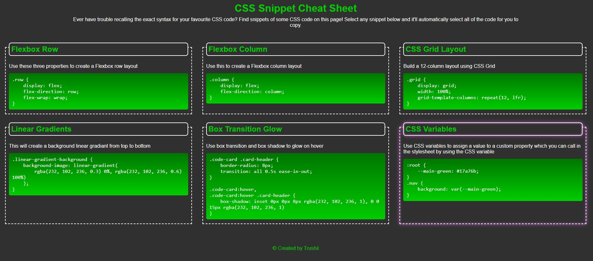

# CSS Snippet Cheat Sheet

## 📖Table of Contents
1. [Description](#description)
2. [Link](#Link)
3. [Screenshots](#Screenshots)
4. [Technologies](#Technologies)
5. [Contributing](#Contributing)
6. [Author](#Author)
7. [License](#License)

## Description

A collection of CSS snippets styled with CSS in a responsive grid

## Link

The link to the deployed application:

CSS Snippet Cheat Sheet: https://trushilbudhia.github.io/CSS-Snippet-Cheat-Sheet/

## Screenshots

The following image shows the web application's appearance and functionality:

## Technologies
- HTML
- CSS

## Contributing
Contributions, issues and feature requests are welcome.

## Author
👤Trushil Budhia
- Github: [@Trushil](https://github.com/TrushilBudhia)
- Email: trushil.budhia@gmail.com

## License
Copyright © 2021 [Trushil](https://github.com/TrushilBudhia)

This project is [MIT](./LICENSE.md) licensed
